# ☁️ CloudOps — Plataforma EKS con GitOps multi-entorno

> **Megaproyecto final de portafolio DevOps/Cloud.**
> De un `git push` en VS Code a producción en AWS EKS, con GitOps (ArgoCD), CI/CD en GitHub
> Actions, observabilidad (Prometheus + Grafana) y teardown reproducible. Documentado en
> video de YouTube.


---

## 🏗️ Arquitectura

```mermaid
flowchart LR
    classDef dev fill:#dcedc8,stroke:#33691e,color:#1a3a08,stroke-width:2px
    classDef cicd fill:#b3e5fc,stroke:#01579b,color:#013a63,stroke-width:2px
    classDef reg fill:#ffe0b2,stroke:#e65100,color:#5d2d00,stroke-width:2px
    classDef git fill:#d1c4e9,stroke:#4527a0,color:#2a1a5e,stroke-width:2px
    classDef k8s fill:#ffccbc,stroke:#bf360c,color:#5c1c0a,stroke-width:2px
    classDef obs fill:#b2dfdb,stroke:#00695c,color:#003830,stroke-width:2px

    subgraph DEV[「 1 · Desarrollo 」]
        direction LR
        IDE["👨‍💻 <b>VS Code</b>"] -->|"git push"| GH["🐙 <b>GitHub</b>"]
    end

    subgraph CI[「 2 · CI/CD 」]
        direction LR
        GH --> GHA["🛠️ <b>GitHub Actions</b><br/><i>build + test</i>"]
    end

    subgraph REG[「 3 · Registro 」]
        direction LR
        GHA -->|"push image"| ECR["📦 <b>Amazon ECR</b>"]
    end

    subgraph GITOP[「 4 · GitOps 」]
        direction LR
        ECR -->|"tag / SHA"| REPO["📚 <b>Repo GitOps</b>"]
        REPO -->|"watch"| ARGO["🌀 <b>ArgoCD</b>"]
    end

    subgraph K8S[「 5 · Cluster EKS 」]
        direction LR
        ARGO -->|"sync"| ING["🚪 <b>Ingress</b>"]
        ING --> FE["⚛️ <b>Frontend</b>"]
        FE --> API["🐍 <b>API</b>"]
        API --> WK["⚙️ <b>Worker</b>"]
    end

    API -->|"SQL"| RDS["🐘 <b>RDS Postgres</b>"]
    API -.->|"secrets"| SM["🔐 <b>Secrets Manager</b>"]
    PM["📊 <b>Prometheus</b>"] -.->|"scrape"| K8S
    GR["📈 <b>Grafana</b>"] -->|"query"| PM
    TF["🏗️ <b>Terraform</b>"] -.->|"provision"| K8S

    class IDE,GH dev
    class GHA cicd
    class ECR reg
    class REPO,ARGO git
    class ING,FE,API,WK k8s
    class TF,RDS,SM reg
    class PM,GR obs

    style DEV fill:#e9f7d5,stroke:#33691e,stroke-width:2px
    style CI fill:#d5effc,stroke:#01579b,stroke-width:2px
    style REG fill:#fff0dc,stroke:#e65100,stroke-width:2px
    style GITOP fill:#e2d9f5,stroke:#4527a0,stroke-width:2px
    style K8S fill:#ffe1d6,stroke:#bf360c,stroke-width:2px
```



### Flujo de despliegue
1. **`git push`** del código (VS Code) a GitHub.
2. **GitHub Actions** corre build + tests. Solo si **todo pasa**:
3. Pushea la imagen a **ECR** (tag inmutable por SHA) y actualiza el tag en el **repo GitOps**.
4. **ArgoCD** detecta el cambio y sincroniza el cluster **EKS** con deploy **canary**.
5. **Prometheus/Grafana** monitorean las métricas; ante error, **rollback automático**.
6. La infraestructura (VPC, EKS, RDS, ECR, S3) la crea **Terraform** como código.

---

## 📁 Estructura

```
.
├── app/                      # App 3 capas (React + FastAPI + worker) + docker-compose
├── terraform/                # IaC: bootstrap + envs (dev/staging/prod) + modules
├── argocd/                   # GitOps: projects + applications + overlays (Kustomize)
├── .github/workflows/        # GitHub Actions (CI/CD + infra + destroy)
├── observability/            # Prometheus + Grafana + Loki
├── docs/                     # Arquitectura, costos, guion de video
└── CLAUDE.md                 # Memoria maestra del proyecto
```

---

## 🚀 Cómo correrlo

> Documentación paso a paso por fase. En fase de construcción.

- **Fase 1 — Local:** `cd app && docker compose up`
- **Fase 2 — Infra:** `terraform init` en `terraform/envs/<env>`
- **Fase 3 — GitOps:** ArgoCD sync
- **Fase 6 — Teardown:** workflow `terraform-destroy` (manual)

---

## 🎬 Video final

Historia: **de un cambio en el código a producción en AWS, y el rollback automático,
todo en vivo.**

---

## 📌 Licencia / Autor

Bryan — [LinkedIn](https://www.linkedin.com/in/bryan-urquizo/). Proyecto de portafolio DevOps/Cloud.
