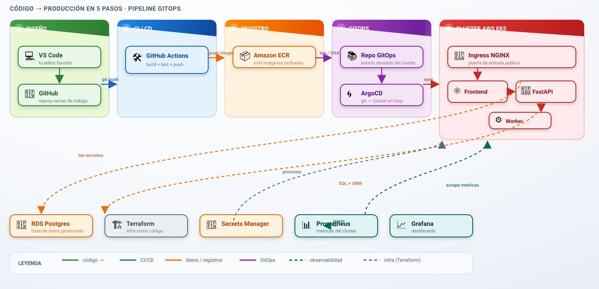

# 🏗️ Arquitectura CloudOps Store

> Diagrama de arquitectura del megaproyecto. Muestra el flujo completo de despliegue
> (código → producción), la infraestructura y la observabilidad.

## Diagrama oficial



> Fuente editable: `docs/diagramas/cloudops-arch.drawio` (abrir con [draw.io](https://app.diagrams.net)).

## Flujo de despliegue

```
VS Code → git push → GitHub Actions (build + tests) → ECR → repo GitOps → ArgoCD → EKS
```

---

## Flujo de despliegue

```
VS Code → git push → GitHub Actions (build + tests) → ECR → repo GitOps → ArgoCD → EKS
```

### Paso a paso
0. **Infraestructura (1 vez):** `terraform apply` crea VPC, EKS, RDS, ECR y S3 (estado remoto).
1. **VS Code:** editás el código de la app (React + FastAPI + worker).
2. **`git push` a GitHub:** arranca todo automáticamente.
3. **GitHub Actions:** corre build + tests. Solo si **todo pasa**:
   - Sube las 3 imágenes (frontend, api, worker) a **ECR** con tag inmutable por SHA.
   - Actualiza el tag de imagen en el **repo GitOps**.
4. **ArgoCD:** detecta el cambio y sincroniza el cluster **EKS**.
5. **EKS:** despliega con estrategia **canary** (progresivo) en dev/staging/prod.
6. **Postgres (RDS):** la base de datos de la app; los secretos se leen de **AWS Secrets Manager**.

### Monitoreo y rollback
7. **Prometheus** recolecta métricas del cluster; **Grafana** las grafica en dashboards.
8. Si se detecta error → **rollback automático**: ArgoCD revierte a la versión anterior.
9. **Teardown:** `terraform destroy` apaga toda la infraestructura.

---

## Componentes clave

| Capa | Componente | Rol |
|------|-----------|-----|
| Código | VS Code + Git | Donde escribís y versionás la app |
| CI/CD | GitHub Actions | Build + tests + push a ECR |
| Registro | Amazon ECR | Guarda las imágenes Docker |
| GitOps | Repo GitOps + ArgoCD | Git como fuente de la verdad; ArgoCD sincroniza |
| Infra | Terraform | Crea VPC, EKS, RDS, ECR, S3 (IaC) |
| Orquestación | Amazon EKS (Kubernetes) | Corre los contenedores de la app |
| Acceso | Ingress (nginx) | Expone la app al exterior por HTTP/HTTPS |
| Datos | Amazon RDS (Postgres) | Base de datos de la app |
| Secretos | AWS Secrets Manager | Contraseñas y tokens, fuera de Git |
| Observabilidad | Prometheus + Grafana | Métricas y dashboards en vivo |
| Estado | S3 + DynamoDB | Estado remoto de Terraform y lock |